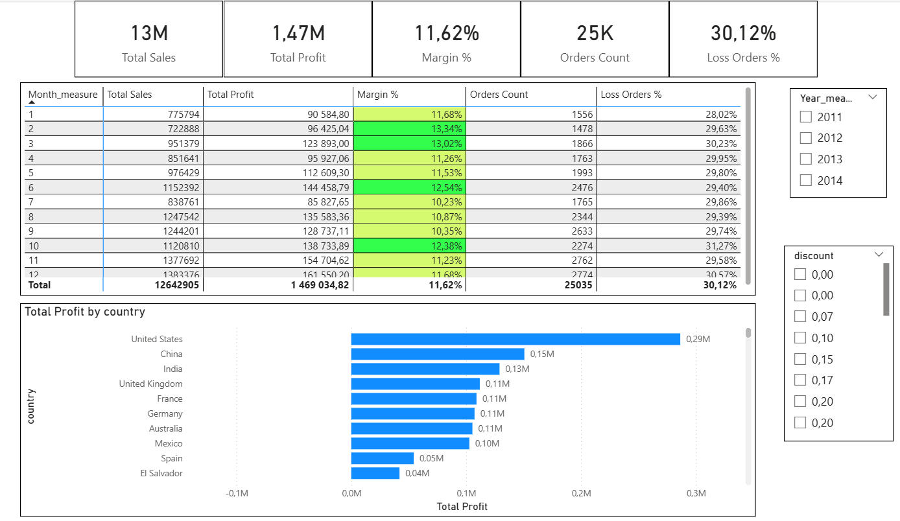
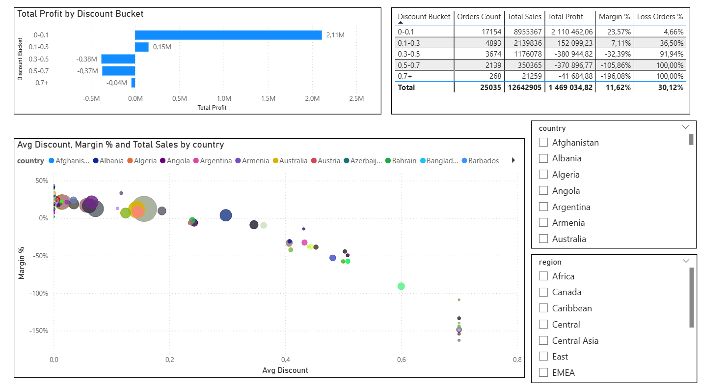
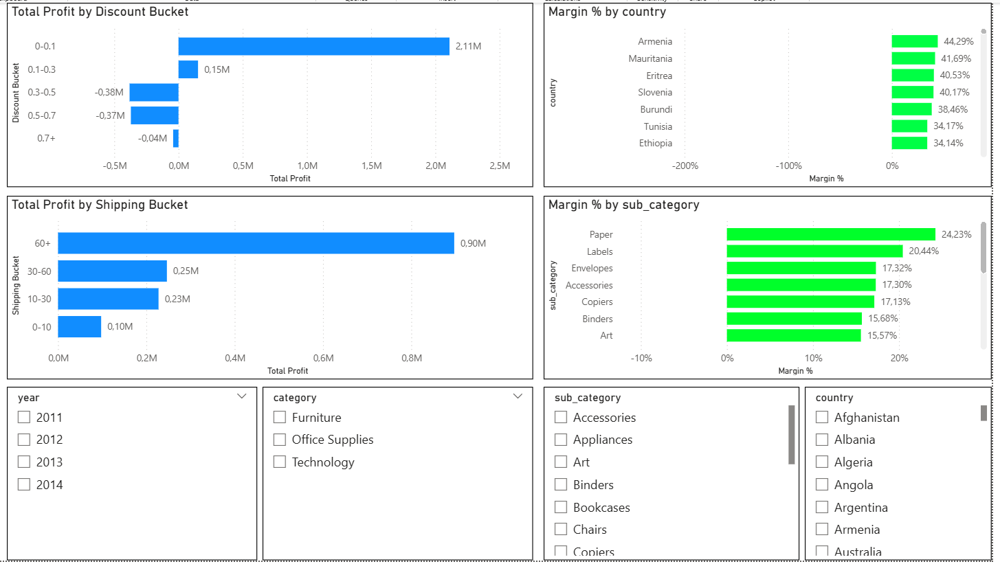
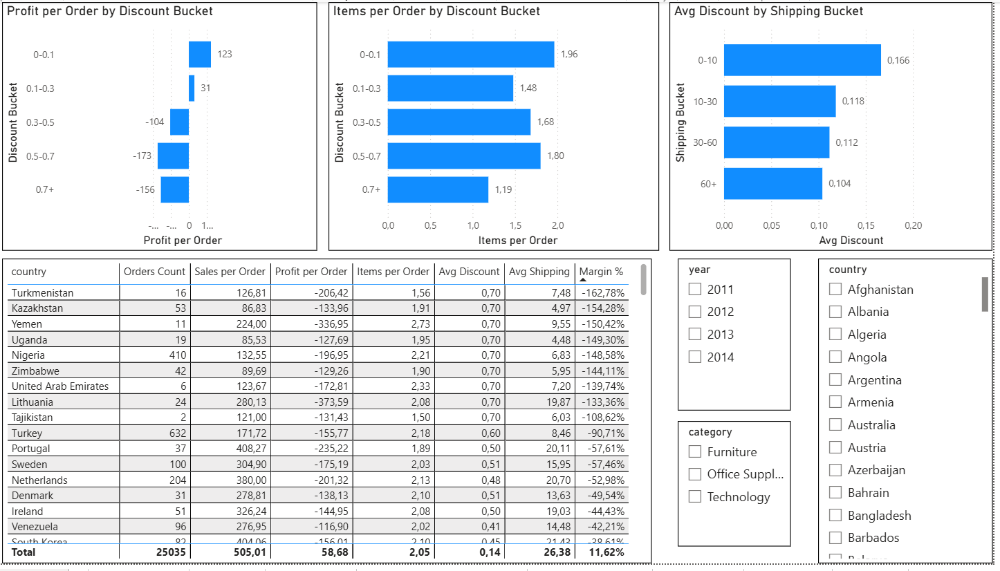
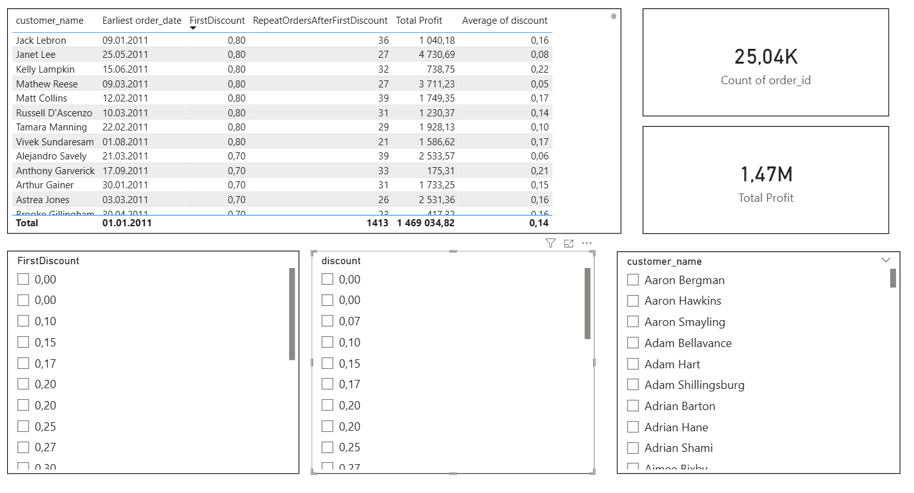
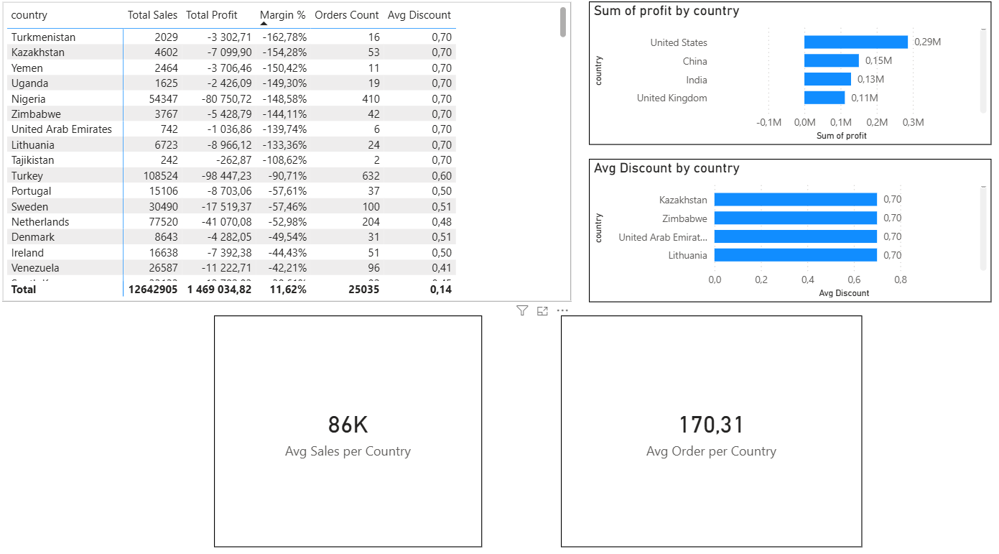
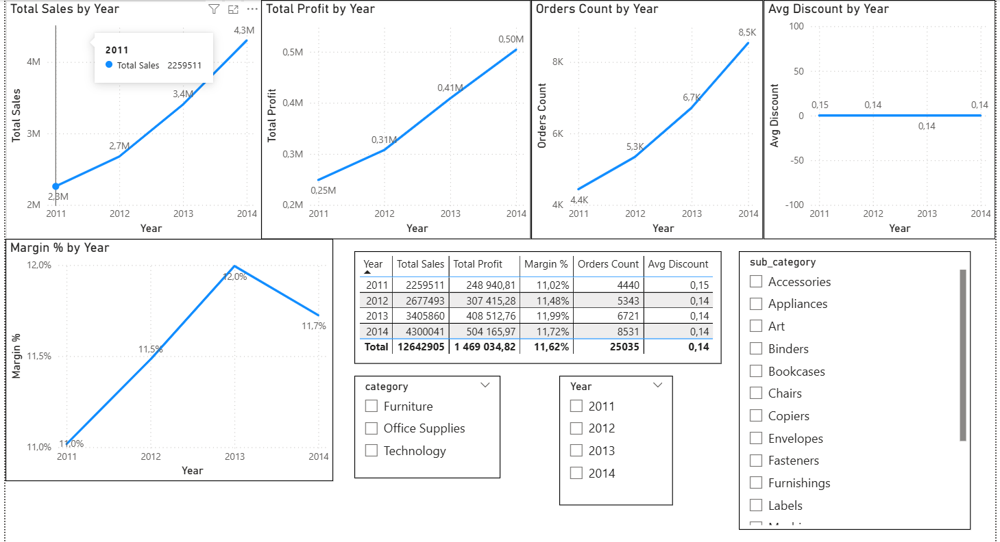
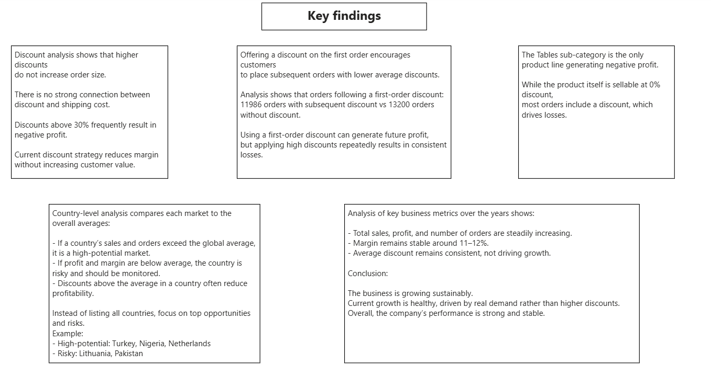
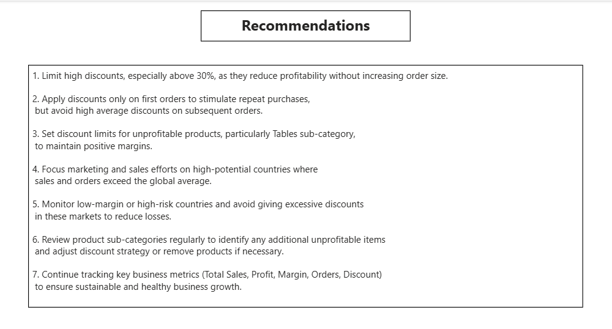

# Superstore Sales Analysis | Power BI + SQL

## Project Overview

This project analyzes sales, profit, discounts, and customer behavior using the Superstore dataset.

The goal of the project is to simulate real business analytics tasks:
- Find reasons for low profit
- Analyze discount impact
- Identify unprofitable products and countries
- Evaluate customer behavior
- Check business growth over time
- Provide business recommendations

The project was built using SQL for data preparation and Power BI for visualization.

---

## Dataset

Source:
Superstore Sales Dataset (Kaggle)

---

## Tools Used

- SQL — data cleaning and transformations
- Power BI — dashboard and analysis
- DAX — measures and calculated columns
- GitHub — project documentation

---

## Dashboard Pages

### 1. Overview
Main business metrics:
- Total Sales
- Total Profit
- Orders Count
- Margin
- Average Discount

General view of business performance.

---

### 2. Discount Analysis
Analysis of discount distribution and its impact on profit.

Findings:
- High discounts often lead to negative profit
- Most orders are made with discount

---

### 3. Profit_drivers
Analysis of factors affecting profit:
- Category / Sub-category
- Discount level
- Country
- Sales vs Profit

Goal:
Find main reasons for low profitability.

---

### 4. Discount_vs_Orders_Shipping
Check relationship between:
- Discount
- Orders count
- Basket size
- Shipping cost

Findings:
Discount does not significantly increase basket size,
but reduces profit.

---

### 5. Discount_vs_Repeat_orders
Check if discount increases repeat orders.

Findings:
- First order discount helps acquire customers
- High average discount leads to losses
- Customers continue buying even with lower discount later

---

### 6. Country_Performance_Analysis
Compare countries by:
- Sales
- Profit
- Margin
- Orders
- Average discount

Goal:
Find underperforming markets.

---

### 7. Business_Growth
Year-by-year analysis:
- Sales
- Profit
- Orders
- Margin
- Discount

Result:
Business is growing steadily,
margin stays stable.

---

### 8. Key_Findings

Main insights:

- Discounts above 30% often cause losses
- Tables sub-category generates negative profit
- Some countries have high sales but negative margin
- Discount increases orders but reduces profitability
- First order discount can help customer acquisition
- Business grows every year

---

### 9. Recommendations

- Limit high discounts (>30%)
- Restrict discounts for Tables
- Review low-profit countries
- Use discount for first order only
- Focus on high-margin markets

---

## Screenshots

---

## Author
Martyn Kovalchuk

Portfolio project for Data / Product Analyst position
